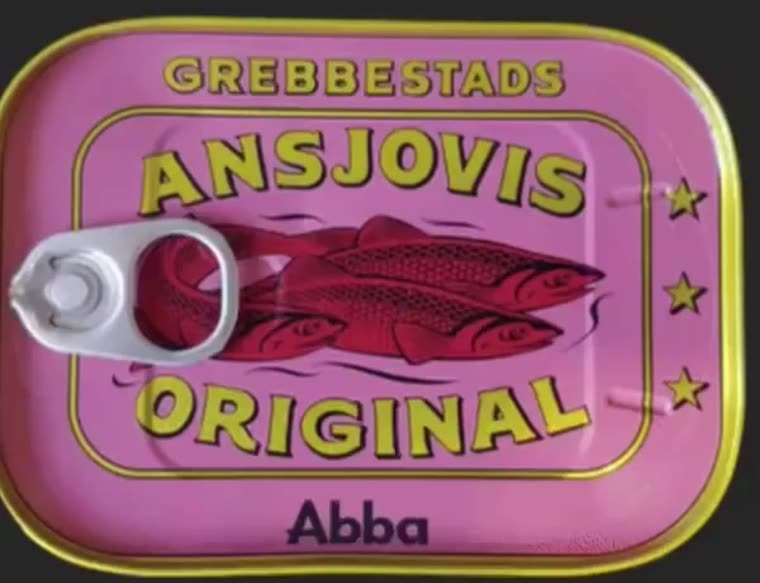
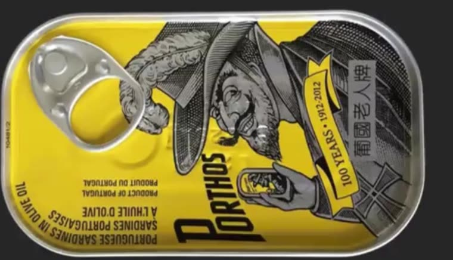
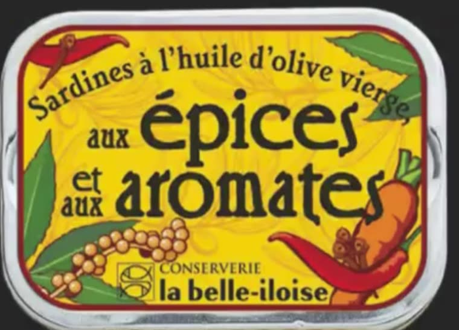
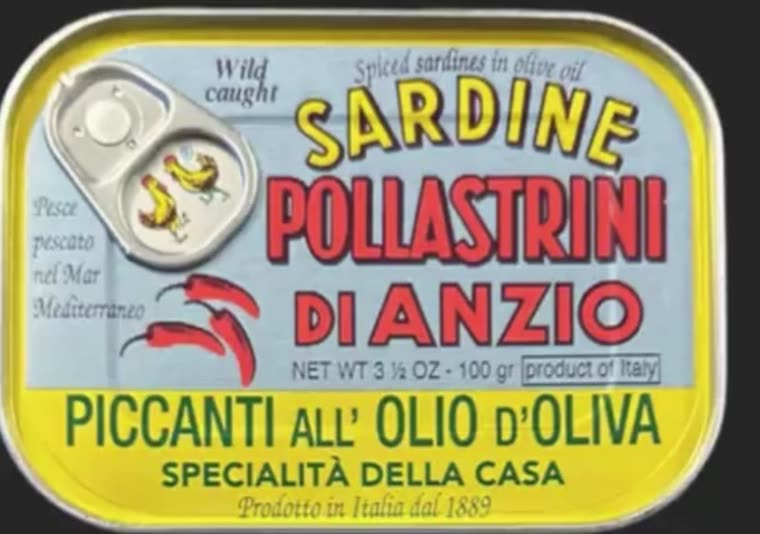

# Conserva Tin Style Guide

The visual language of European tinned-fish packaging. Derived from four cans
studied frame by frame (see `../assets/`). Read this before drawing anything.

---

## 1. The shared grammar

These four cans come from four countries and a century of different printing
tech, yet they read as one family. The common rules:

**The tin is part of the drawing.** Never draw a rectangle of label art floating
in space. The chrome or brass rim, the corner radius, the ring pull, the sheen
across the lid — these are compositional elements. On Porthos the ring pull eats
the top-left corner of the illustration and the artwork is *drawn around it*. On
Abba the pull tab sits on top of the fish. Plan the pull into the layout.

**A frame or a field split, then everything hangs off it.**
- Abba: double keyline frame inset ~8%, words riding on and through it.
- Belle-Iloise: single red rule, deliberately broken by leaves and chilies.
- Pollastrini: no frame — instead the field splits pale blue (top 2/3) / chrome
  yellow (bottom 1/3), and the split carries the hierarchy.
- Porthos: no frame at all, the illustration bleeds to the rim.

Pick one of these three devices (frame / broken frame / field split / no frame)
before you place a single letter.

**Curved baselines.** Display words follow arcs concentric with the tin's
corner radius. Top lines arc up (convex), bottom lines arc up too, so the frame
reads as a lens. Belle-Iloise sets an entire sentence on a sagging arc that
mirrors the top-left corner. Nothing important is set on a dead-flat baseline
except the single largest word.

**Fill the surface.** Vintage grocery packaging has no whitespace instinct.
Margins are thin, copy is stacked, ornament fills gaps. If your draft looks
airy and modern, it is wrong. Target ~85% ink coverage inside the frame.

**Everything gets a keyline.** Illustrations carry a dark outline of consistent
weight, and so does any display word set in a color other than the ink itself
(words already printed in the ink color need none). This is a printing artifact (spot colors
registered against a black plate) that became the look. Outline weight is
roughly 6–10% of a letter's cap height, `stroke-linejoin: round`.

**Flat spot color, no gradients in the artwork.** Two to five opaque inks. The
*only* gradients are in the metal — rim, ring pull, lid sheen. A gradient in the
illustration instantly reads as modern vector art and breaks the spell.

**Layered information, often multilingual.** Product name, flavor/preparation,
oil type, origin, net weight, heritage date, export-market translation, legal
copy. Porthos carries Portuguese, French, English and Chinese simultaneously.
Pollastrini mixes Italian and English. This density *is* the aesthetic.

**A heritage claim, always.** "ORIGINAL", "100 YEARS · 1912-2012", "Prodotto in
Italia dal 1889", "CONSERVERIE". Plus small ornamental tallies — the three
stars on Abba, the monogram square on Belle-Iloise, the boxed "product of
Italy" on Pollastrini.

**Hand irregularity.** Letters are drawn, not typeset. Baselines wobble by a
degree, letter widths vary, the "S" in a word is fractionally bigger than the
"A". Perfectly kerned type is the single biggest tell of a fake.

---

## 2. The four archetypes

Pick one as the parent for any new drawing. Do not blend all four — each one is
internally consistent, and mixing produces mush.

### A. Nordic Spot-Color (ref: Abba Grebbestads Ansjovis)

- **Format:** shallow rounded rect, radius ≈ 18% of the short side. Brass/gold
  rim, not chrome. Litho printed directly on the lid.
- **Field:** one loud flat color, full bleed. Here a bubblegum pink — the
  confidence is in choosing a color no food brand would choose.
- **Frame:** double keyline inset ~8% — a thick yellow rule with a thin dark
  line just inside it. Corners follow the tin radius.
- **Type:** heavy sans with softened corners and slightly rounded terminals,
  wide letterspacing, yellow fill + dark outline. Three sizes: arched word above
  the frame (GREBBESTADS), hero word inside (ANSJOVIS), arched word below
  (ORIGINAL). All caps, all arced convex-up.
- **Illustration:** a shoal of 3–4 fish in *one* flat ink (crimson) plus black
  linework, overlapping each other, swimming right. Texture is a field of
  regular dots along the dorsal flank standing in for scales. Two or three
  loose squiggle strokes behind = water. No background, the pink shows through.
- **Modern note:** a contemporary geometric sans wordmark ("Abba") in soft navy
  sits *outside* the frame at the bottom. One modern element against all that
  vintage is the whole trick.
- **Palette:** pink `#D07CB0` · brass yellow `#E3D24A` · crimson `#B01243` ·
  ink `#2B1620` · navy `#2E2A4F`

### B. Steel Engraving (ref: Porthos)

- **Format:** oblong "club" tin, corner radius ≈ half the short side. Bare
  aluminium rim, ring pull top-left.
- **Field:** chrome yellow, full bleed. **Two inks only: yellow and black.**
- **The whole technique is line density.** There is no grey ink anywhere. Every
  tone is made of black line on yellow:
  - flat parallel rules at 3 spacings = three tonal steps
  - cross-hatch at 45°/135° = the darkest tone
  - stipple = skin, faces, soft forms
  - contour hatching that follows a form's curvature = volume
  - pure white-of-the-yellow = highlights, left untouched
- **Subject:** a 19th-century character portrait, engraved pastiche — a figure
  in a hat and heavy coat, drawn at large scale, cropped by the tin edge. The
  figure *holds the product* (a tin of Porthos) — a self-referential gag worth
  stealing.
- **Type:** heavy black sans for the brand, set at a slight angle, with a long
  swash/underline descending from the first letter. A yellow banner ribbon with
  black outline carries the heritage line. Legal copy in small condensed caps,
  bottom, upside-down relative to the brand (the tin is read from either end).
- **Palette:** chrome yellow `#F2C500` · ink `#141414`. That is the entire
  palette. Resist adding a third.

### C. Art Nouveau Hand-Lettering (ref: La Belle-Iloise)

- **Format:** rectangular tin, generous radius, full chrome rim visible on all
  four sides including the pressed "ear" dimples at the short sides.
- **Field:** saturated chrome yellow carrying a **tone-on-tone ground pattern** —
  swirling Art Nouveau tendrils in a yellow ~8% darker than the field, almost
  subliminal. This is the single most transferable move on any of these cans.
- **Border:** one vermilion rule inset ~6%, with a hairline dark outline. The
  illustrations deliberately cross it.
- **Type:** hand-lettered Art Nouveau roman — high-contrast, flared serifs,
  bulging bowls, the "e" with an angled bar. Mixed sizes *within one sentence*:
  "aux" is tiny and italic, "**épices**" is enormous. The connective words are
  subordinated, not aligned. Top line set on a strong downward arc following the
  corner.
- **Illustration:** flat vector botanicals — bay leaves, red chilies, a carrot,
  peppercorn sprays. Construction of each: one opaque base color, one lighter
  highlight shape inside it for volume, one uniform dark-brown keyline around
  the whole thing. That's it — three elements, no shading. They enter from the
  corners, overlap each other, and break the border rule.
- **Logo:** small square monogram mark + "CONSERVERIE" in caps above a friendly
  semi-bold lowercase brand name.
- **Palette:** chrome yellow `#F3CE0A` · ground tint `#E0B100` · vermilion
  `#C22A20` · leaf green `#4E8A3C` · deep green `#2F6B34` · carrot `#E4802A` ·
  ink brown `#2A1E12`

### D. Typographic Maximalism (ref: Pollastrini di Anzio)

- **Format:** rectangular tin, chrome rim, ring pull top-left.
- **Field split:** Wedgwood pale blue-grey upper ~70%, chrome yellow lower ~30%.
  The split does the job a frame does elsewhere.
- **Type carries everything** — six distinct styles stacked, each a different
  color and flavor:
  1. italic script line across the top ("Spiced sardines in olive oil"), ink
  2. bouncy rounded geometric caps, yellow fill + black outline, on an arc,
     each letter slightly wonky ("SARDINE")
  3. the hero: heavy condensed grotesque, red fill + black outline, packed
     edge to edge ("POLLASTRINI")
  4. same red, wider and lighter ("DI ANZIO")
  5. bottle-green caps on the yellow band ("PICCANTI ALL' OLIO D'OLIVA")
  6. small italic serif for provenance, ragged-left in the margin
- **The ruled box.** Net weight in caps, then "product of Italy" inside a thin
  rectangular rule. A boxed origin statement is a beautiful vintage grocery tic.
- **Illustration is subordinate** — a tiny drawing of an *open* tin with
  sardines and a chili, tucked beside the ring pull, plus two loose chilies.
  When type is this loud, the picture gets small.
- **Palette:** pale blue `#B8CCD7` · chrome yellow `#E8D820` · red `#E23B2E` ·
  yellow type `#F5D51E` · bottle green `#1E6B45` · ink `#1B1B1B`

---

## 3. Type

You cannot letter by hand in SVG, so pick faces that fake it, then distress
them. Google Fonts stand-ins by archetype:

| Role | Face | Notes |
|---|---|---|
| Nordic hero caps (A) | `Bowlby One SC`, `Archivo Black` | widen letter-spacing to 0.06em |
| Engraving brand (B) | `Anton`, `Archivo Black` | add the descending swash as a path |
| Art Nouveau display (C) | `Almendra Display`, `Berkshire Swash`, `Grenze` | the closest to Auriol on Google Fonts |
| Maximalist hero (D) | `Anton`, `Archivo Narrow 700` | condensed, packed to the margins |
| Bouncy outlined caps | `Fredoka`, `Baloo 2` | rotate each letter ±2° individually |
| Italic provenance copy | `EB Garamond` italic, `Playfair Display` italic | |
| Condensed legal copy | `Oswald`, `Archivo Narrow` | 300 weight, letter-spaced caps |

**Always do these two things to typeset words:**
1. Outline them: `paint-order="stroke fill"`, stroke = the ink color, width
   6–10% of cap height, `stroke-linejoin="round"`.
2. Break the machine regularity: set important words letter by letter in
   `<tspan>`s with ±1.5° rotation and ±1% size variance, or run them on a
   `textPath` arc.

---

## 4. Color discipline

- 2–5 opaque inks per can, no more. Porthos uses 2.
- High chroma. These are chrome yellows, vermilions, bubblegum pinks — not
  muted "heritage" browns. The palette is loud; the *drawing* is old.
- One field color dominating 60–100% of the surface.
- The ink color is never pure `#000000` — use a warm or cool near-black
  (`#1B1B1B`, `#2A1E12`, `#2B1620`) so it sits in the same world as the inks.
- Metal is the only place gradients live.

---

## 5. Checklist before calling a drawing done

- [ ] Rim, corner radius and ring pull drawn, and the artwork composed around them
- [ ] One organizing device chosen (frame / broken frame / field split / bleed)
- [ ] At least one display word on a curved baseline
- [ ] Every display word whose fill isn't the ink color is outlined in it
- [ ] Letterforms broken out of perfect alignment
- [ ] Flat spot colors only in the artwork; gradients only on metal
- [ ] Coverage is dense — thin margins, stacked copy, ornament in the gaps
- [ ] A heritage claim and a small ornamental tally present
- [ ] Net weight / origin line, ideally in a ruled box
- [ ] Texture is line or dot, never a soft shadow: hatch, cross-hatch, stipple
- [ ] Lid sheen + corner vignette applied so it reads as metal, not paper
- [ ] Grain overlay at 3–6% opacity over the whole lid
