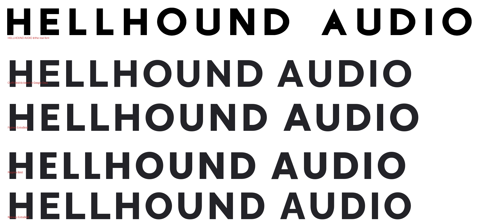

# Hellhound Audio in Google Docs

## The part that cannot be fixed

**Google Docs cannot install a custom font, and nothing changes that.** Its font
menu is served from the Google Fonts library. There is no upload, on a personal
account or through Workspace admin, and no add-on can add one either — Apps
Script's `setFontFamily()` takes "any font from the Font menu in Docs or Google
Fonts", and an unrecognised name silently renders as Arial rather than being
kept.

So there are exactly two ways the real lettering reaches a Google Doc: **as an
image**, or **after the document leaves Docs**. Everything below is built around
that. The one genuine exception is getting the font into the Google Fonts
library itself, which is real but expensive — last section.

## What to actually do

| Need | Use | Fidelity |
|---|---|---|
| The logo at the top of a document | The wordmark image | Exact |
| Headings and body the boss types and edits | Outfit, bolded | Close, not exact |
| A branded document to start from | `docs-kit/hellhound-letterhead.docx` | Exact logo, stand-in text |
| The finished document, printed or sent | `docx_swap.py` after download | Exact |

### 1. The letterhead — start here

`docs-kit/hellhound-letterhead.docx` is a ready document with the wordmark
already placed and the text styled.

1. Go to Google Drive → **New → File upload** → pick the `.docx`.
2. Right-click it in Drive → **Open with → Google Docs**.
3. **File → Save as Google Doc** if it opens in preview.
4. The boss now types into a branded doc. The wordmark is an image, so it is the
   real lettering, not a substitute.

To make it the default for new documents, open it and use **File → Make a
copy** each time, or submit it to your Workspace template gallery
(**File → Save as template** if your plan has it).

### 2. Live text: Outfit

Google Docs cannot show Hellhound Audio, but **Outfit** is the closest thing in
the library. I scored every plausible geometric sans in Google Fonts against the
real face across the whole alphabet — Outfit and Figtree came out on top at
about 80% shape match and 6% average error on letter widths.

To add it: font box → **More fonts** → search *Outfit* → tick it → **OK**. Then
use **Outfit** with **Bold** on for headings.



Be clear-eyed about this: it is a family resemblance, not the font. Outfit has
no thunderbolt `I`, no spur, no crossbar-less `Λ`, and it is a little narrower.
**Never set the company name in it** — use the image for that. It is for the
running text around the logo.

Google Docs has no letter-spacing control, so the wordmark's wide tracking
cannot be reproduced in live Docs text at all. Another reason the name goes in
as an image.

### 3. The wordmark as an image

`docs-kit/` has transparent PNGs and SVGs ready to drop in: `wordmark`,
`wordmark-white` (for dark backgrounds), and `wordmark-hellhound` /
`wordmark-audio` if you want to stack the two words.

**Insert → Image → Upload from computer**, then drag a corner to size it. Use
the PNGs — Docs will not take an SVG. Make more at any size or colour:

```bash
python3 src/wordmark.py "MASTERED AT HELLHOUND AUDIO" \
    --out docs-kit/strapline --bolt '#d7282f' --height 400
```

### 4. Put the real font back on the way out

This is how a finished document ends up in Hellhound Audio. The boss never
leaves Docs; the swap happens on the file afterwards.

1. In Docs: **File → Download → Microsoft Word (.docx)**.
2. Run:

```bash
python3 src/docx_swap.py ~/Downloads/brief.docx --from Outfit --to "Hellhound Audio"
```

That writes `brief-branded.docx` with every Outfit run re-pointed at the real
font. Open it in Word, Pages or Affinity — anywhere the `.otf` is installed —
and print or export the PDF from there.

It rewrites font names only, in the attributes that carry them, across
`document.xml`, `styles.xml`, `fontTable.xml`, headers, footers and notes. Body
text, images, tables and layout are untouched, and every other font is left
alone — pass `--from`/`--to` more than once to remap several at a time.

**Two things to know.** The machine doing the final render needs the `.otf`
installed; the swap does not embed the font in the file. And I verified the
output structurally here — valid archive, well-formed XML, correct fonts, text
and images intact — but this sandbox has no working Word or LibreOffice, so it
has not been opened in Word. Try it on one document before you trust it with
something that matters.

## The only way into the Docs font menu

If Hellhound Audio were **in the Google Fonts library**, it would appear in the
Docs font menu like any other font and every problem above would go away.

That is a real path, and this is what it costs:

- **The font has to be open source**, under the SIL Open Font License. Google
  Fonts does not host proprietary fonts. That means anyone in the world could
  download and use your studio face, including competitors. For a brand font
  that is usually the reason not to do it.
- **It has to pass their technical bar.** Submissions go through the
  `google/fonts` GitHub repository and are checked with Font Bakery — metadata,
  naming, vertical metrics, outline quality, a proper glyph set. The font would
  need real work first: it is currently caps-only with no accented characters,
  and Google Fonts expects broad language coverage.
- **Google chooses what to onboard.** It is a curated library, not a public
  upload. Expect months, and acceptance is not guaranteed.

Worth it if you want the face to be a public typeface. Not worth it if it is
meant to be yours. Say the word and I will prepare the submission package —
licence, metadata, the extended character set — so the decision is just a yes or
no rather than a project.

## What I would not bother with

- **Extensis Fonts add-on.** Discontinued, and it only ever served Google Fonts
  anyway — it never did custom uploads.
- **Apps Script setting the font name directly.** It falls back to Arial on an
  unrecognised name, so the boss would be typing into something that looks
  wrong on screen.
- **Blog posts promising "upload custom fonts to Google Docs".** They are
  describing adding fonts from the Google Fonts library, or another product
  entirely.
