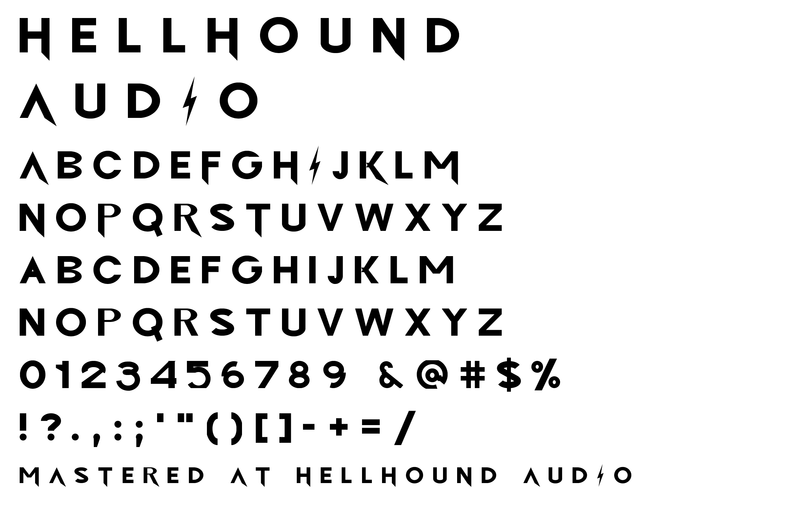
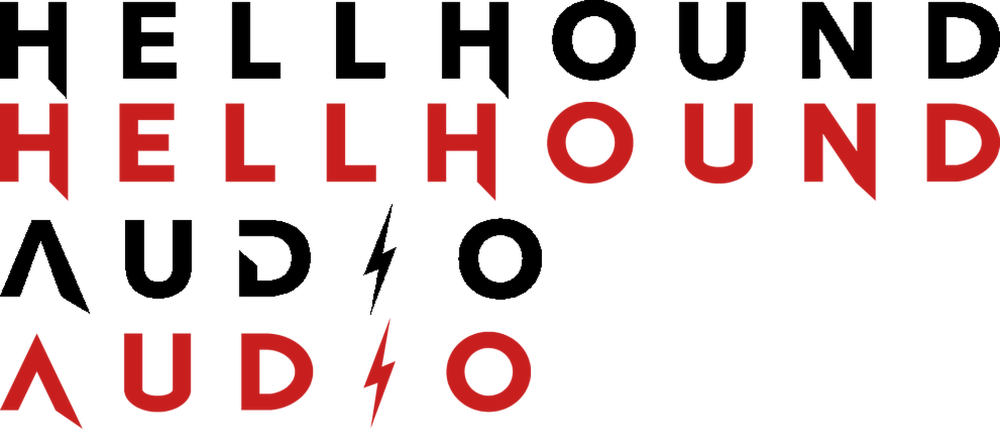

# Hellhound Audio

The studio's own face, rebuilt from the logo: a bold geometric sans, drawn to
the wordmark's own measurements, with the thunderbolt `I` and the spurred caps.



## Drawn from the logo, not by eye

The wordmark was measured at cap height 76px and the font built to those
numbers. Every letter the logo contains now matches it to within 0.6%:

| | H | E | L | O | U | N | D | stroke |
|---|---|---|---|---|---|---|---|---|
| logo (width ÷ cap) | 0.868 | 0.697 | 0.632 | 1.105 | 0.868 | 0.908 | 0.934 | 0.237 |
| font | 0.869 | 0.697 | 0.631 | 1.099 | 0.867 | 0.909 | 0.933 | 0.237 |



*Black is the logo, red is the font, set at the same cap height.*

The bolt is not a redraw — the red shape was traced out of the logo artwork and
reduced to its six corners, so it is the same bolt.

## Two alphabets, one keyboard

Caps only, but the two cases give *different* capitals:

| You type | You get |
|---|---|
| `SHIFT` — `HELLHOUND` | **Marked caps**: the descending spur, the crossbar-less `Λ`, and the thunderbolt `I`. The logo cut. |
| unshifted — `hellhound` | **Plain caps**: no spur, a normal `A`, a plain `I`. |

Switch with the shift key alone — no character palette, and it survives
copy-paste anywhere, because underneath it is ordinary upper- and lowercase
text. Use the marked cut for logos and titles, the plain cut for tracklists and
credits where the spurs get noisy small.

### The spur

Measured off the logo, it is a right triangle on the rightmost stem: from the
stem's inner edge at the baseline down to a tip 170 units below, with the outer
edge carrying on along its own slope — vertical on the `H`, angled on the `A`.
That slope is read from each glyph rather than assumed.

It sits on capitals whose rightmost stroke is a straight stem: **A F H K M N P
R T**. On a bowl (`B D O S`) or a bottom bar (`E L Z`) there is no stem to hang
it from and it reads as a blot, so those stay clean.

**Two judgement calls you may want reversed**, both one edit in
`src/build.py`:

- The logo's own `N` has **no** spur, though structurally it is the same letter
  as `H`. I included it for consistency. Drop the `N` from `SPURRED` to match
  the logo exactly, or set it to `"AH"` for only the two letters the logo shows.
- The spur is on the **right**-hand stem. Swap the `max(...)` for `min(...)` in
  `foot_spike`'s sibling `spur()` in `src/geom.py` to move it left.

## Setting it like the wordmark

The logo is tracked far wider than the font's default spacing. To match it:

**tracking 268** (Affinity and InDesign use 1/1000 em, so type `268`).

At that setting `HELLHOUND` measures exactly the logo's width. The bolt `I` is
red in the logo; set that one character in your accent colour by hand, or let
the exporter do it.

## Installing

**macOS** — select the `.otf` files in `dist/`, double-click, *Install Font*.
Quit and reopen Affinity afterwards; it scans fonts at launch.
**Windows** — select them, right-click, *Install for all users*.

Three cuts, each its own family so they can be stacked: `Hellhound Audio`,
`Hellhound Audio Outline`, `Hellhound Audio Shadow`. Shadow is the extrude —
put it behind Regular in a second colour. All three share metrics, so layers
register exactly.

## Google Docs

Google Docs cannot install custom fonts — no upload, no admin setting, no
add-on. The full playbook for working around that is in
**[GOOGLE-DOCS.md](GOOGLE-DOCS.md)**: a ready letterhead in `docs-kit/`, the
closest stand-in in the Google Fonts library (Outfit), wordmark images to drop
in, and `src/docx_swap.py` to put the real font back when the document is
downloaded on its way out.

## Character set

`A–Z` `a–z` (both are capitals), `0–9` and
`& @ # $ % ! ? . , : ; ' " ( ) [ ] - – — / \ + = * _ ·`

Digits and punctuation have one form each. Kerning covers both alphabets.
Metrics: 1000 units/em, cap height 700, stroke 166 vertical / 148 horizontal.
The marked caps descend to -170 for the spur and the bolt to -166, so the
family needs a little more line height than its cap suggests.

## Rebuilding

```bash
pip install fonttools shapely brotli pillow
python3 src/build.py dist      # compile all 9 files
python3 src/verify.py dist     # structural checks + render from the binaries
```

| File | Role |
|---|---|
| `src/glyphs.py` | Every glyph. Straight letters are bars and ellipse rings; the curved ones (`S 2 3 5 6 9 &`) are centrelines given a thickness, which is far easier to keep clean than stacking booleans. |
| `src/geom.py` | Primitives, the spur finder, and the outline / extrude passes. |
| `src/build.py` | Compiles the cuts; holds the kerning, the case mapping and `SPURRED`. |
| `src/wordmark.py` | SVG and PNG exporter. |
| `src/verify.py` | Structural checks, and renders from the compiled binaries rather than the sources. |

Letter widths live in the `g(...)` calls in `src/glyphs.py`; the stroke weights
are `S`, `HB`, `CS` and `DS` at the top of that file.

## A note on the other family

`fonts/hellhound-stamp/` is the chiselled display face from the first pass,
drawn from the RAHWAY artwork. It is a different animal — heavy, faceted,
nothing to do with this wordmark — so it now carries its own name rather than
this one. Rename it in its own `src/build.py` if you would rather it were
called something else.

## Naming and licence

Name, copyright and vendor ID are in `src/build.py` (`setupNameTable`,
`achVendID`). Embedding is unrestricted (`fsType = 0`), so the fonts can travel
inside print-ready PDFs.
