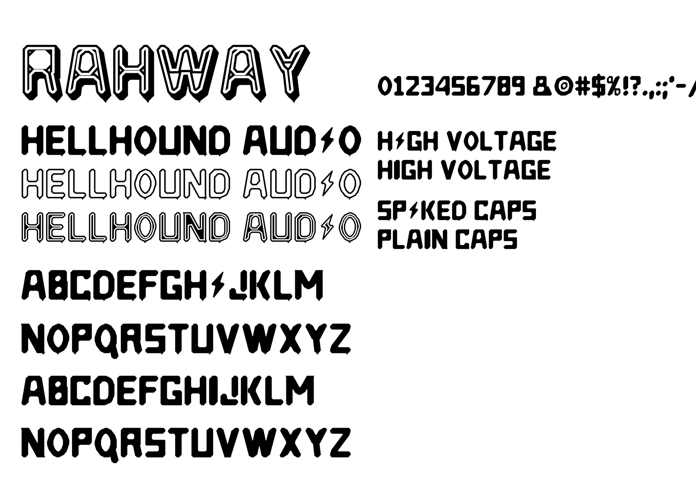

# Hellhound Audio

A chiselled, caps-only display typeface in four layerable cuts, drawn from the
RAHWAY logo: heavy faceted capitals, an inline keyline, and a hard 3-D extrude.



## The four cuts

Each cut installs as its **own font family**, not as a weight of one family, so
they can be stacked on top of each other in a layout.

| Family name | Files | What it is |
|---|---|---|
| `Hellhound Audio` | `HellhoundAudio.*` | The solid cut. Start here. |
| `Hellhound Audio Inline` | `HellhoundAudioInline.*` | Solid, with a keyline channel cut just inside the edge. |
| `Hellhound Audio Outline` | `HellhoundAudioOutline.*` | Hollow — the perimeter only. |
| `Hellhound Audio Shadow` | `HellhoundAudioShadow.*` | The extrude. Always sits *behind* another cut. |

Every cut ships as `.otf`, `.ttf` and `.woff2` in [`dist/`](dist). They all share
the same metrics and kerning, so layers line up exactly.

- **`.otf`** — use these for desktop apps (Affinity, Illustrator, InDesign, Word).
- **`.ttf`** — same outlines; use if an app or device refuses the OTF.
- **`.woff2`** — for the web only.

Install one format, not both, or the font menu will show duplicates.

## Installing

**macOS** — select the four `.otf` files in `dist/`, double-click, and press
*Install Font*. Or drop them into `~/Library/Fonts`. Quit and reopen Affinity
afterwards; it scans fonts at launch.

**Windows** — select the four `.otf` files, right-click, *Install for all users*.

## Affinity (Designer / Photo / Publisher)

Pick `Hellhound Audio` from the font menu and type. Lowercase keys produce
capitals, so there is no mixed-case accident to clean up.

To rebuild the full logo treatment:

1. Set your text and duplicate the layer.
2. Put the **lower** copy in `Hellhound Audio Shadow` and colour it (black, or a
   flat spot colour).
3. Put the **upper** copy in `Hellhound Audio Outline` (or `Inline`, or
   `Regular`) in a contrasting colour.
4. Keep both layers at the same size, position and tracking. They are drawn on
   identical metrics, so they register exactly.

The extrude runs down and to the right. Give the artwork some room on those two
sides — the shadow deliberately overhangs the text box.

## Google Docs

**Google Docs cannot install custom fonts.** Its font menu only offers fonts
from the Google Fonts catalogue, and there is no upload — not on a personal
account, and not through Workspace admin either. That applies to Slides and
Sheets too. Nothing about this font works around it; it is a limitation of Docs.

So for Docs, use a picture of the lettering. The exporter makes one at any size,
in any cut, with a transparent background:

```bash
python3 src/wordmark.py "HELLHOUND AUDIO" --style layered --out build/logo
```

That writes `build/logo.svg` and `build/logo.png`. In Docs use **Insert → Image →
Upload from computer** and pick the PNG. Useful flags:

| Flag | Does |
|---|---|
| `--style` | `regular`, `inline`, `outline`, `shadow` or `layered` (the full 3-D treatment) |
| `--ink` / `--fill` | Hex colours, e.g. `--ink '#d93a1e'` |
| `--height` | PNG height in pixels — go large (1200+) so it stays sharp when scaled |
| `--tracking` | Letter spacing, in 1/1000 em |
| `--pad` | Margin around the artwork |

The `.svg` is the one to hand to a printer or drop into Affinity — it is vector
and scales without loss. Docs will not accept SVG, which is why both come out.

If you want live, editable text in a Google doc, the honest options are to set
it in Affinity and paste it in as an image, or to pick the closest Google Fonts
stand-in for body copy and keep Hellhound Audio for headings and artwork.

## Web

Each cut is a separate family:

```css
@font-face {
  font-family: "Hellhound Audio";
  src: url("HellhoundAudio.woff2") format("woff2");
  font-weight: 800;
  font-display: swap;
}
h1 { font-family: "Hellhound Audio", system-ui, sans-serif; }
```

Open [`specimen.html`](specimen.html) in a browser for a working example,
including the CSS for stacking Shadow behind the other cuts.

## Two alphabets, one keyboard

The font is caps-only, but the two cases give you *different* capitals:

| You type | You get |
|---|---|
| `SHIFT` — `HELLHOUND` | **Marked caps**: a spur under the right-hand foot of every letter, and a thunderbolt for the `I`. |
| unshifted — `hellhound` | **Plain caps**: no spurs, an ordinary bar for the `i`. |

So `HIGH` sets with spurs and a bolt, `high` sets clean, and you switch between
them with the shift key alone — no character palette, no stylistic-set menu, and
it survives copy-paste into any app because it is ordinary upper- and lowercase
text underneath.

Mix them deliberately: marked caps for a logo or a title, plain caps for a
tracklist or credits where the spurs would get noisy at small sizes.

The spur is found automatically rather than from a hand-kept table — each glyph
is measured to see what it actually plants on the baseline, and the spur is hung
under the right-hand end of that foot. Letters that land on a point (the bolt,
and `V`/`W` where the strokes converge) get none, because there is no foot to
hang it on. Tune the size in one place: `foot_spike()` in `src/geom.py`
(`depth`, `lean`, `min_width`, `max_width`). Move it to the left-hand foot by
swapping the `max(...)` for a `min(...)` in the same function.

## Character set

`A–Z` `a–z` (both are capitals — see above), `0–9` and
`& @ # $ % ! ? . , : ; ' " ( ) [ ] - – — / \ + = * _ ·`

Digits and punctuation have one form each; the spur is a letter feature only.
Kerning covers both alphabets (`AV`, `LT`, `WA`, `Y.` and the rest).

Metrics: 1000 units/em, cap height 700. Descenders on `Q , ; $ / \ _` and on
every marked cap, which drops to -42 for the spur.

## Rebuilding from source

The outlines are generated, not hand-drawn, so edits are made in code and the
whole family is recompiled at once.

```bash
pip install fonttools shapely brotli pillow
python3 src/build.py dist      # compile all 12 files
python3 src/verify.py dist     # structural checks + render from the binaries
python3 src/proof.py proof/proof.png
```

| File | Role |
|---|---|
| `src/glyphs.py` | Every glyph, as heavy bars and wedges on a 1000-unit grid. `Ibolt` is the thunderbolt capital. |
| `src/geom.py` | The chamfer pass, the spur finder, and the inline / outline / extrude operations. |
| `src/build.py` | Compiles the four cuts to OTF, TTF and WOFF2; holds the kerning and the case mapping. |
| `src/wordmark.py` | SVG and PNG exporter. |
| `src/proof.py`, `src/verify.py` | Proof sheets and binary checks. |

The look comes from one shared pass in `geom.py`: each glyph is assembled from
plain rectangles and wedges, then every corner is cut back. Corners facing
up-left or down-right get a deep cut and the rest get a nick, as if the whole
alphabet were carved with one chisel under one light. Change `_AXIS` or the
`directional` amount in `assemble()` and the entire family re-cuts consistently.

To make the letters heavier or lighter, edit the bar coordinates in
`src/glyphs.py`; to change the extrude angle or depth, edit `SHADOW_VECTOR` in
`src/build.py` (the wordmark exporter reads the same value).

## Naming and licence

The name, copyright string and vendor ID are set in `src/build.py` — see
`setupNameTable` and `achVendID`. Change them there and rebuild if this needs to
ship under a label or studio name. Embedding is unrestricted (`fsType = 0`), so
the fonts can be embedded in PDFs sent to a printer.
